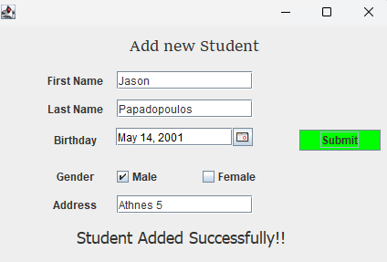

# School Management System

This Java project is a school management system developed using Eclipse IDE and PostgreSQL database. The system allows users to manage courses, students, and their grades within a school environment. It utilizes relational databases with foreign keys and constraints to ensure data integrity.

## Features

- **Add Course**: Add new courses to the system.
- **Add Student**: Add new students along with their details.
- **Assign Course to Student**: Assign courses to students for enrollment.
- **Grade Student**: Grade students for their performance in courses.
- **Search Student**: Search for students by their name or ID.
- **Update Student**: Update student details such as name, address, etc.
- **Delete Student**: Delete students from the system. (Utilizes cascading delete to maintain data consistency)
  

## Getting Started

To run this project locally, follow these steps:

1. Clone this repository to your local machine.
2. Set up PostgreSQL database and ensure it's running.
3. Open the project in Eclipse IDE.
4. Update the database connection details in the source code to match your PostgreSQL setup.
5. Run the project in Eclipse.

## Dependencies

- Java JDK
- Eclipse IDE
- PostgreSQL

## ScreenShots
 

 

 

